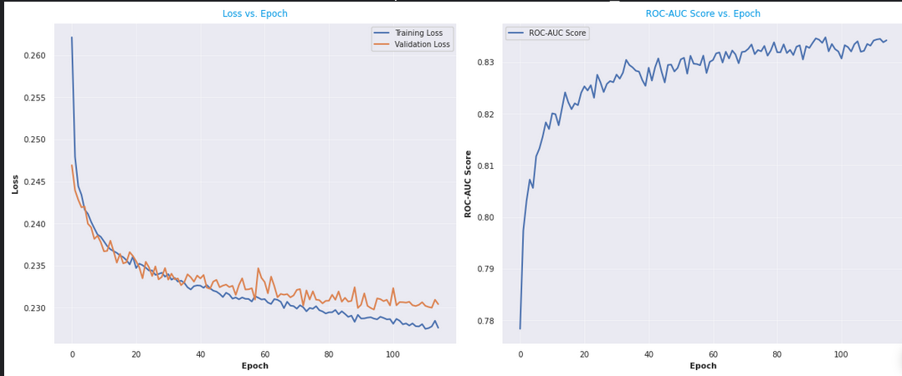
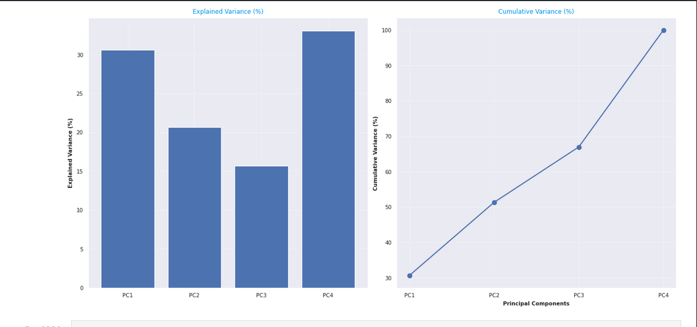

## Steel Plate Fault Classification Prediction
## Project Overview

This project aims to develop a predictive model to classify various types of faults in steel plates based on surface inspection data. The model utilizes features such as the area of defects, luminosity, and geometric properties to classify faults like bumps, dirtiness, scratches, and others. The final model achieved an accuracy of 83% on the validation dataset, demonstrating its effectiveness in predicting steel plate faults.

## Business Understanding

Fault detection in steel plates is crucial for ensuring product quality and preventing defects in manufacturing processes. Stakeholders for this project include manufacturers, quality control teams, and engineers. The business problem addressed is the efficient identification and classification of faults in steel plates, which currently relies on manual inspection. Our predictive model aims to automate this process, improving efficiency and reducing error rates.

## Data Understanding

The dataset used for this project consists of various features related to the surface inspection of steel plates. These features include geometric properties, luminosity, and area measurements of defects. Despite some missing data in certain columns, the dataset is generally well-structured.

## Modeling and Evaluation

Several machine learning models were developed for this project, including Gradient Boosting and a neural network. Additionally, an ensemble model comprising XGBoost and a neural network was trained. The models were evaluated using metrics such as accuracy, precision, recall, and F1-score. The ensemble model, consisting of XGBoost and a neural network, achieved an accuracy of 83% on the validation dataset, demonstrating its effectiveness in predicting steel plate faults.

## Feature engineering

Mutual information analysis and principal component analysis

## Conclusion

The predictive model developed in this project effectively classifies faults in steel plates based on surface inspection data. This model can automate the fault detection process, leading to improved product quality and manufacturing efficiency. Future steps could include deploying the ensemble model in real-time inspection systems or integrating it into existing quality control processes for seamless fault detection.
